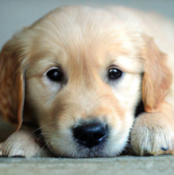

New 

|
CFG=1

Model generates more random images **without** following class labels

|
![ref1]CFG=5

|
CFG=10

Model **strictly follows** class labels.
|
| :- | :- | :- |

` `**CFG = 1 (Low Guidance)**

1. The model generates **random images** with little adherence to the given class label.
1. The generated content lacks coherence, often producing **unstructured or mixed objects**.

` `**CFG = 5 (Moderate Guidance)**

1. The model follows the class label **more closely** but still introduces **some variations**.
1. The generated images maintain **reasonable quality** with recognizable features.

` `**CFG = 10 (Strong Guidance)**

1. The model **strictly adheres** to the given class label.
1. The generated images are **clear, high-quality, and well-defined**.
1. However, **high CFG** values lead to **over-sharpening and artifacts**.

CFG modifies the **denoising process** in diffusion models by adjusting the **conditional probability** of generating an image given a class label. 

The final noise estimate is:

ϵfinal=ϵuncond+CFG×(ϵcond−ϵuncond)\epsilon\_{\text{final}} = \epsilon\_{\text{uncond}} + \text{CFG} \times (\epsilon\_{\text{cond}} - \epsilon\_{\text{uncond}})ϵfinal​=ϵuncond​+CFG×(ϵcond​−ϵuncond​)

- **Low CFG (near 1):** The term ϵcond−ϵuncond\epsilon\_{\text{cond}} - \epsilon\_{\text{uncond}}ϵcond​−ϵuncond​ has **low weight**, meaning the model adds more randomness and follows the class weakly.
- **High CFG (10+):** The term ϵcond−ϵuncond\epsilon\_{\text{cond}} - \epsilon\_{\text{uncond}}ϵcond​−ϵuncond​ is amplified, making the model follow the class **strictly**, but at the cost of losing diversity.

CFG=5

Sampling   variation

|

sampling=50

7 seconds time  
|
![ref2]

sampling=250

40 seconds time  
|

sampling=500

1\.14 minutes  seconds time  
|
| :- | :- | :- |

**Observations from the Image:**

- **Sampling = 50**

  - The image is blurryer  and lacks details as the model did not have enough steps to fully denoise and reconstruct detailed features.
  - Faster generation time (7 seconds).
- **Sampling = 250**

  - The image is much clearer and better structured.
  - More fine details are present, and the model has refined the noise effectively.
  - Longer generation time (40 seconds).
- **Sampling = 500**

  - The highest clarity and finest details.
  - The textures, shading, and structure appear more realistic.
  - Longest time(1.14min)

diffusion models work by gradually removing noise from a random latent space using a reverse process. More sampling steps mean:

1. Each step slightly reduces noise, leading to better structure.
1. Features like fur, eyes, and textures become more detailed.
1. The trade-off for this  is computation time.

torch.manual\_seed(seed)

num\_sampling\_steps = 50 #@param {type:"slider", min:0, max:1000, step:1}

cfg\_scale = 3 #@param {type:"slider", min:1, max:10, step:0.1}

class\_labels = [207] \* num\_images

samples\_per\_row = 4 #@param {type:"number"}

With Xformers its  giving or errors while loading the state dic which i was not able to solve 

[ref1]: Aspose.Words.76f12625-10f6-470f-bae9-4b97bb42e52c.004.png
[ref2]: Aspose.Words.76f12625-10f6-470f-bae9-4b97bb42e52c.007.png
