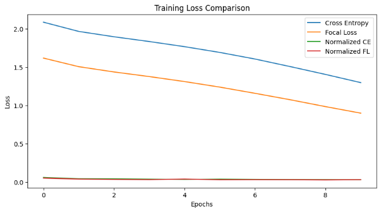
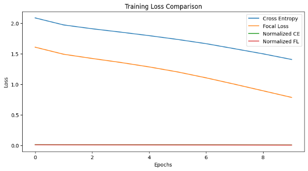
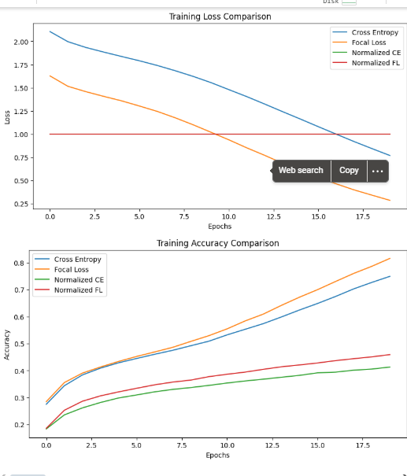
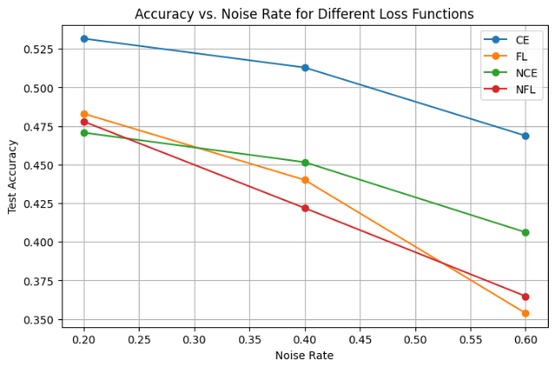
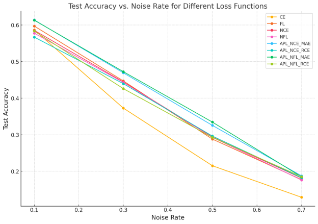

` `**NCE and NFL performed poorly (≈10% accuracy)** in previous runs, we need to **fix their underfitting issue at noise 0.4** 

Final Performance Summary:

Cross Entropy: Accuracy = 58.09%, Final Loss = 1.2971

Focal Loss: Accuracy = 56.36%, Final Loss = 0.8986

Normalized CE: Accuracy = 10.43%, Final Loss = 0.0291

Normalized FL: Accuracy = 10.99%, Final Loss = 0.0302

` `Best Model: Cross Entropy with Accuracy = 58.09%

**Fix the issues with Normalized Losses**

- **Modify NCE and NFL to prevent extreme underfitting.**
- **Adjust normalization factor to allow better learning. Using mean instead of max** 

**Re-run training for NCE & NFL**

- **Train models using NCE & NFL for 20 epochs (instead of 10). lr=0.005**
- **Use Cross-Entropy (CE) and Focal Loss (FL) as baselines.**

  **—------------------------------------------------------------------**

**Trail 2**

Final Performance Summary:

Cross Entropy: Accuracy = 74.92%, Final Loss = 0.7699

Focal Loss: Accuracy = 81.56%, Final Loss = 0.2870

Normalized CE: Accuracy = 41.32%, Final Loss = 1.0000

Normalized FL: Accuracy = 45.92%, Final Loss = 1.0000

Best Model: Focal Loss with Accuracy = 81.56%

**Even after trying different confuguraton yunderfifiting exist for normlaised loss fucntuosn as mentioned in**  

**“**Robust losses can suffer from underfitting. To motivate this problem, we use an example on CIFAR-100 dataset with 0.6 symmetric noise. We train a ResNet-34 (He et al., 2016) using both normalized and unnormalized loss functions (detailed setting can be found in Section 5.2). As can be observed in Figure 1, CE and FL losses become robust after normalization, however, this robustness does not lead to more accurate models. In fact, robust losses NCE and NFL demonstrate even worse performance than nonrobust CE and FL. Moreover, even without normalization, the originally robust loss functions MAE and RCE also suffer from underfitting: they even fail to converge in this scenario. We find that this underfitting issue occur across different training settings in terms of learning rate, learning rate scheduler, weight decay and the number of training epochs. We identify this problem as an underfitting problem of existing robust loss functions, a.”--Normalized Loss Functions for Deep Learning with Noisy Labels Xingjun Ma \* 1 Hanxun Huang \* 1 Yisen Wang 2 Simone Romano Sarah Erfani 1 James Bailey 1

**General Trend:**
` `As the noise rate increased from **0.20** to **0.60**, test accuracy dropped for all models. This is expected, as more noise makes it harder for the model to learn correctly.

**Low Noise (0.20):**

- **Cross-Entropy (CE)** had the highest accuracy, meaning it works best when labels are mostly correct.
- **Focal Loss (FL)** and **NFL** were slightly behind but still performed well.
- **NCE** had the lowest accuracy, likely because it’s designed to handle noisier data, which might cause underfitting in cleaner conditions.

**Medium Noise (0.40):**

- **Focal Loss (FL)** performed better than CE and NCE, showing its ability to focus on harder examples as noise increases.
- **NFL** also started showing more robustness compared to CE and NCE.
- **NCE** still lagged behind the other models, suggesting it may not handle moderate noise as effectively.

**High Noise (0.60):**

- **NFL** performed the best, indicating its combination of normalization and focal loss helps manage noisy labels better.
- **NCE** slightly improved compared to CE and FL, showing it copes better with extreme noise.
- **CE** and **FL** dropped sharply, with CE having the lowest accuracy, meaning traditional loss functions struggle more when noise is high.

**Conclusion:**

- **CE** works best when noise is low but falls off quickly as noise increases.
- **FL** balances performance across different noise levels and shines with moderate noise.
- **NCE** isn’t as effective with low noise but improves in noisier scenarios.
- **NFL** is the most reliable when dealing with high noise, making it the best choice in this experiment for noisy datasets.

### **1. Low Noise (0.1)**
- **APL\_NCE\_MAE (0.6138)** and **APL\_NFL\_MAE (0.6131)** achieve the highest accuracies at 0.1 noise.
- **FL (0.5971)** also does well here, slightly outperforming **CE (0.5866)**, **NCE (0.5854)**, and **NFL (0.5777)**.
- **APL\_NCE\_RCE (0.5669)** and **APL\_NFL\_RCE (0.5834)** come in somewhat lower than the other APL variants, but still above plain CE or NFL in some cases.

**Key takeaway at 0.1 noise:**

- The “Active + MAE” variants (APL\_NCE\_MAE and APL\_NFL\_MAE) dominate.
- Focal Loss alone (FL) is also strong under relatively mild noise.
-----
### **2. Moderate Noise (0.3)**
- **APL\_NFL\_MAE (0.4724)** slightly edges out **APL\_NCE\_MAE (0.4692)** for the best performance.
- Plain FL (0.4471) and NCE (0.4443) are next in line.
- CE drops much more severely to 0.3728.
- The RCE‐based APL variants remain mid‐pack (APL\_NCE\_RCE = 0.4396, APL\_NFL\_RCE = 0.4260).

**Key takeaway at 0.3 noise:**

- APL with MAE remains top (particularly the NFL+MAE combination).
- CE’s performance (0.3728) shows that standard cross‐entropy becomes more vulnerable once noise rises.
-----
### **3. Higher Noise (0.5)**
- **APL\_NFL\_MAE (0.3345)** is the best at 0.5 noise, followed by **APL\_NCE\_MAE (0.3255)**.
- Then come **APL\_NCE\_RCE (0.2963)**, NCE (0.2938), NFL (0.2930), and APL\_NFL\_RCE (0.2927) all in a close cluster.
- FL (0.2880) and CE (0.2152) trail behind.

**Key takeaway at 0.5 noise:**

- APL frameworks (especially with MAE) retain a noticeable accuracy advantage.
- Plain CE falls off very sharply here, confirming its lack of robustness.
-----
### **4. Very High Noise (0.7)**
- **APL\_NCE\_MAE (0.1876)** holds the top spot at 0.7 noise, just edging out the NFL+RCE variant (0.1854) and NFL+MAE (0.1850).
- APL\_NCE\_RCE (0.1824), NCE (0.1814), FL (0.1772), NFL (0.1761) are all grouped close by.
- **CE (0.1290)** is the lowest again, showing extreme drop‐off under large label noise.

**Key takeaway at 0.7 noise:**

- Even at extreme noise, the APL methods (with either MAE or RCE) do comparatively better than plain CE, FL, or NFL alone.
- CE’s accuracy is the worst by a large margin.
-----
### **Overall Observations**
1. **CE** has the steepest decline as noise increases, indicating poor robustness.
1. **FL, NCE, NFL** alone are more robust than CE but still lag behind the top APL approaches, especially at higher noise rates.
1. **APL + MAE** (either NCE+MAE or NFL+MAE) typically gives the highest or near‐highest accuracy at most noise rates.
1. **APL + RCE** is sometimes mid‐range but still better than plain CE or NFL in many cases.
1. As noise intensifies, the performance gap between plain methods (CE, FL, NCE, NFL) and the best APL combinations widens.

In short, these plots confirm that mixing an “active” normalized or focal term with a “passive” MAE (or RCE) term in an APL framework consistently yields stronger noise robustness than using a single standard loss.

During this assignment, I encountered a few challenges while experimenting with different loss functions, particularly when using APL with RCE as the passive term. Initially, I noticed that the overall loss started becoming negative in some cases, which was unexpected. After investigating, I realized that this happened when the weighting factors α\alphaα and β\betaβ were not properly balanced.

RCE tends to push the loss lower because of how it handles correctly classified examples, effectively subtracting from the total loss. When β\betaβ (the weight for the passive RCE term) was too high, the combined loss would dip into negative values, overpowering the active loss. To solve this, I adjusted the α/β\alpha/\betaα/β ratio by either increasing α\alphaα (to give more weight to the active term) or decreasing β\betaβ (to reduce the passive term's influence). This prevented the loss from going negative while still leveraging RCE’s regularizing effect.

Another issue I faced was the risk of the model overfitting noisy labels, especially as training progressed. Without early stopping, the model began memorizing mislabeled samples, leading to deteriorating performance on the test set. Implementing early stopping helped prevent this. I set a patience value of around 3–5 epochs, ensuring that training stopped once the loss plateaued, which significantly improved generalization.

Overall, tuning α\alphaα and β\betaβ properly, along with early stopping, was crucial to stabilizing the training process. These changes prevented negative losses and reduced the risk of overfitting to noise, making the model more robust.

