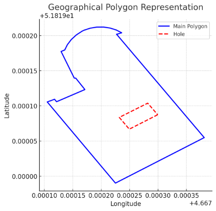
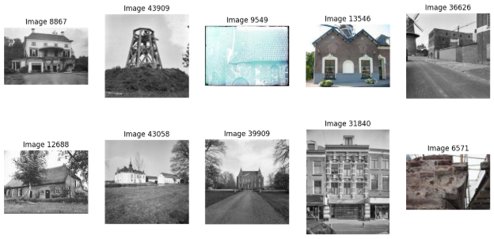
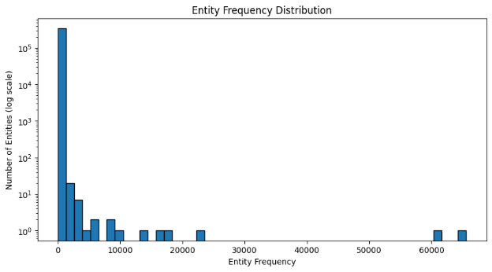
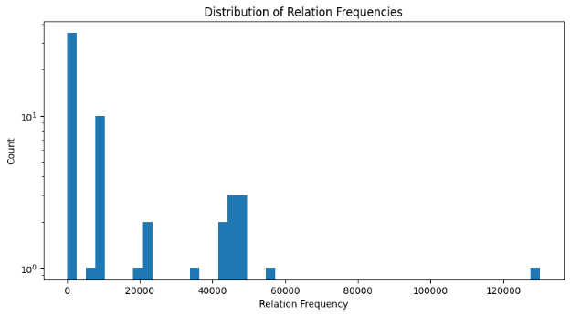
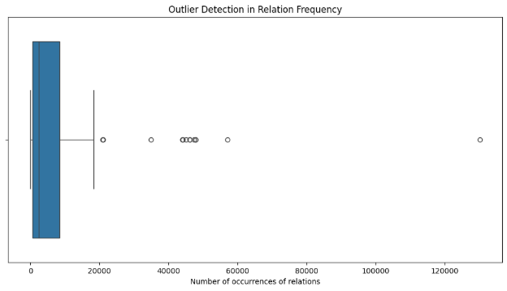
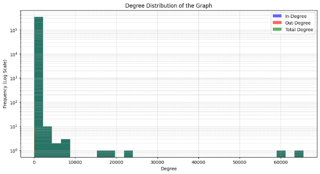
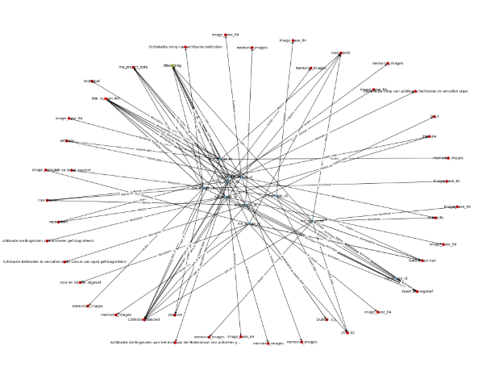

[Copy_of_run_DiT (1).ipynb](https://colab.research.google.com/drive/184VGKBEmPQQNF5nKoq4SjrYYRZBry1Zs?authuser=1) was facing error {There was an error rendering your Notebook: the 'state' key is missing from 'metadata.widgets'. Add 'state' to each, or remove 'metadata.widgets'. Using nbformat v5.10.4 and nbconvert v7.16.6}

### <a name="_xztchabizcce"></a>**1. Dataset Overview**
- **Dataset Name**: dmg777k
- **Number of Entities (Nodes)**: **341,270**

- **Number of Relations (Edges)**: **60**

- **Number of Triples**: **777,124**


This means the knowledge graph consists of **341,270 nodes**, connected by **60 types of relationships**, forming **777,124** (triples).
### <a name="_oojqkw5lx2a7"></a>**Available Data Types:**
1. **Textual Data Types**:
   1. @es: Spanish language text
   1. @fy: Frisian language text
   1. @nl: Dutch language text
   1. @nl-nl: Dutch language text (specific to Netherlands)
   1. @pt: Portuguese language text
   1. @ru: Russian language text
1. **IRI (Internationalized Resource Identifier)**:
   1. iri: This is used for resources identified by IRIs, which are often used to uniquely identify things like URLs or URIs in datasets.
1. **None**:
   1. none: Likely represents missing or undefined data.
1. **Geospatial Data Types**:
   1. http://www.opengis.net/ont/geosparql#wktLiteral: Represents a Well-Known Text (WKT) geometry, which is a standard format for representing geometric objects (such as points, lines, and polygons) in geographic data.
1. **Image Data Type**:
   1. http://kgbench.info/dt#base64Image: Represents images stored in base64 encoding, which is typically used to encode image data for storage or transfer in text formats.
1. **Boolean**:
   1. http://www.w3.org/2001/XMLSchema#boolean: Boolean values (True or False).
1. **Date/Time Data Types**:
   1. http://www.w3.org/2001/XMLSchema#gYear: Represents a year value (e.g., 2023).
1. **Integer Data Types**:
   1. http://www.w3.org/2001/XMLSchema#nonNegativeInteger: Represents non-negative integers (0, 1, 2, …).
   1. http://www.w3.org/2001/XMLSchema#positiveInteger: Represents positive integers (1, 2, 3, …).
1. **URI**:
   1. http://www.w3.org/2001/XMLSchema#anyURI: Represents a URI, which is a reference to a resource (could be a URL, URN, or other identifier).

-----
### <a name="_d44t7szddujx"></a>**2. Dataset Attributes**
- \_\_class\_\_: Returns the class of the object.
- \_\_dict\_\_: Stores attributes of the object in a dictionary form.
- \_\_doc\_\_: Stores the docstring of the class or module.
- \_\_eq\_\_, \_\_ge\_\_, \_\_gt\_\_, \_\_le\_\_, \_\_lt\_\_, \_\_ne\_\_: Define comparison operations (==, >=, >, <=, <, !=).
- \_\_hash\_\_: Returns a hash value, useful for using objects in sets or dict keys.
- \_\_init\_\_: Constructor method, initializes the object.
- \_\_repr\_\_: Defines how the object is represented as a string (useful for debugging).
- \_\_str\_\_: Defines how the object is printed as a string.
- \_\_sizeof\_\_: Returns the memory size of the object.
- \_\_weakref\_\_: Supports weak references to the object.
- \_\_reduce\_\_, \_\_reduce\_ex\_\_: Used for object serialization (pickling).
- \_\_subclasshook\_\_: Allows modifying subclass behavior.
  -----
  ### <a name="_wb3ykls9wc7y"></a>**Dataset-Specific Attributes**
- **name**: Likely the name of the dataset.
- **num\_classes**: Number of unique classes in the dataset (if it’s a classification task).
- **num\_entities**: Number of entities in the dataset (likely for knowledge graphs or relational data).
- **num\_relations**: Number of relationships between entities (useful in graph datasets).
- **triples**: Stores the dataset as a list of triples (subject, predicate, object), commonly used in knowledge graphs.
- **withheld**: Possibly refers to data that is reserved for testing or validation.
  -----
  ### <a name="_vd2e4g33gsss"></a>**Mappings Between IDs and Labels**
- **e2i (Entity to Index)**: Maps entities (real-world objects) to their corresponding integer index.
- **i2e (Index to Entity)**: Maps indices back to entities.
- **r2i (Relation to Index)**: Maps relationships to their index values.
- **i2r (Index to Relation)**: Converts index values back to relationship names.
  -----
  ### <a name="_9azoozz1652d"></a>**Datatype Handling**
- **\_datatypes**: Stores different data types used in the dataset.
- **\_dt\_g2l / \_dt\_l2g**: Likely functions for converting global to local datatypes and vice versa.
- **datatype\_g2l / datatype\_l2g**: Public methods for converting datatype representations.
  -----
  ### <a name="_gmfj75mu6qjz"></a>**Graph-Related Attributes**
- **dgl**: Might refer to a Deep Graph Library (DGL) representation of the dataset.
- **pyg**: Might refer to PyTorch Geometric (PyG), another graph processing library.
- **torch**: Indicates integration with PyTorch for deep learning.
  -----
  ### <a name="_ptorvir3vcw1"></a>**Functions for Data Retrieval**
- **get\_images**: Retrieves images from the dataset.
- **get\_images\_batch**: Fetches images in batches (useful for training models).
- **get\_strings**: Retrieves string data (e.g., text descriptions or labels).
- **get\_strings\_batch**: Retrieves a batch of string data.
  -----
  ### <a name="_gm18aekwf1yw"></a>**Training and Finalized Data**
- **training**: Indicates whether the dataset is in training mode.
- **final**: Possibly a flag to indicate if the dataset is finalized (no further modifications allowed).


-----
### <a name="_vhgefk1ynuwd"></a>**3. Sample Triples (Graph Structure)**
The first five triples are:

(130685, 28, 54795)

(130685, 31, 201822)

(130690, 28, 58948)

(130690, 31, 201822)

(130691, 28, 63024)

(subject, predicate, object)

Example 

To interpret the triple **(130685, 28, 54795)** from dataset, we need to map the numerical IDs to actual entity names and relations using the dataset’s **entity-to-index (e2i/i2e) mapping** and **relation-to-index (r2i/i2r) mapping**.  For this   it  is 
### <a name="_scp1jafup3ys"></a>**Interpreting the Triple**
1. **Subject (130685)**:
   1. **URI:** http://bag.basisregistraties.overheid.nl/bag/id/geometry/0003549B7CE875B77925FFA6CC2C2861
   1. This is an identifier for a geometry object in the Dutch **BAG (Basisregistraties Adressen en Gebouwen)** system, which stores address and building registration data.
1. **Predicate (28)**:
   1. **Relation:** http://www.opengis.net/ont/geosparql#asWKT
   1. This relation comes from the **GeoSPARQL** ontology and represents a **spatial object as a Well-Known Text (WKT) geometry**.
1. **Object (54795)**:

**WKT Polygon:**

` `POLYGON ((4.667227191836703 51.81920171648348, 4.667236120685068 51.819203883584755, ...))

1. This is a **polygon shape** representing a geographical area in **longitude-latitude coordinates**.
### <a name="_nzyoozygw89i"></a>**Meaning of the Triple**
This triple states that:

The **spatial object** identified by http://bag.basisregistraties.overheid.nl/bag/id/geometry/0003549B7CE875B77925FFA6CC2C2861 has a **geometric representation** in **WKT format**, which defines a polygon covering a specific area.

This is commonly used in **GIS (Geographic Information Systems)** and **Linked Open Data (LOD)** to represent buildings, land parcels, or other spatial objects.



-----
### <a name="_xmcuvgjznywi"></a>**4. Entity and Relation Mappings**
- **Entity-to-Index Mapping** (first 5 examples) includes some Dutch textual descriptions, suggesting this dataset might relate to **Dutch historical sites or monuments**.
- **Index-to-Relation Mapping** includes properties from **DBpedia ontology**, such as:
  - http://dbpedia.org/ontology/location
  - http://dbpedia.org/ontology/name
  - http://dbpedia.org/ontology/codeNationalMonument

This suggests that the dataset contains **geographical and cultural information**.

-----
### <a name="_s1zdoky66xhz"></a>**5. Data Types**
The dataset contains multiple types of data:

- **Textual information** (@nl, @es, etc. → Dutch, Spanish, etc.)
- **Images** (http://kgbench.info/dt#base64Image)
- **Geospatial Data** (http://www.opengis.net/ont/geosparql#wktLiteral)
- **Boolean and Integer Data** (http://www.w3.org/2001/XMLSchema#boolean)

Ten  images of 46061 images 



**RelationShips** 
#### <a name="_7bscovx1h4sx"></a>**1. Geospatial Relationships (Location & Mapping)**
These relationships describe spatial information about entities:

- http://www.opengis.net/ont/geosparql#asWKT → Stores spatial data as WKT (Well-Known Text).
- http://www.opengis.net/ont/geosparql#hasGeometry → Links entities to their geometric representation.
- http://www.opengis.net/ont/geosparql#sfWithin → Specifies whether an entity is within another spatial region.
- http://www.geonames.org/ontology#locationMap → Provides a link to a location map.
- http://www.geonames.org/ontology#parentADM1 → Parent administrative division (e.g., province/state).
- http://www.geonames.org/ontology#parentADM2 → Parent administrative division (e.g., district).
- http://www.geonames.org/ontology#parentCountry → Links an entity to its country.
- http://www.geonames.org/ontology#parentFeature → Links an entity to a broader geographical feature.
- http://www.w3.org/2003/01/geo/wgs84\_pos#alt → Altitude of a place.

**What it means:**
` `These properties define geographical structures like **regions, neighborhoods, and places**.

-----
#### <a name="_ndp09ad3nnxj"></a>**2. Identity & Classification Relationships**
These relationships define **what something is** or link it to external datasets:

- http://www.w3.org/1999/02/22-rdf-syntax-ns#type → Defines the type of an entity (e.g., building, monument).
- http://www.w3.org/2000/01/rdf-schema#label → Provides a human-readable name for an entity.
- http://www.w3.org/2000/01/rdf-schema#isDefinedBy → Links an entity to its definition source.
- http://www.w3.org/2000/01/rdf-schema#seeAlso → Provides additional information.
- http://www.w3.org/2002/07/owl#sameAs → Links an entity to an equivalent entity in another dataset.

**What it means:**
` `These properties help in **categorizing** entities and linking them to external knowledge sources.

-----
#### <a name="_qu56ygiclop3"></a>**3. Descriptive Relationships (Names, Features, and Details)**
- http://dbpedia.org/ontology/name → Name of a place or object.
- http://dbpedia.org/ontology/neighbourhood → Links a location to its neighborhood.
- http://www.geonames.org/ontology#name → Another property for naming.
- http://www.geonames.org/ontology#alternateName → Alternate names.
- http://www.geonames.org/ontology#officialName → Official names.
- http://xmlns.com/foaf/0.1/name → FOAF (Friend of a Friend) name property.

**What it means:**
` `These properties define **how things are named or identified** across different data sources.

-----
#### <a name="_3bn07iiyam5s"></a>**4. Structural & Administrative Relationships**
- http://dbpedia.org/ontology/city → Links an entity to its city.
- http://purl.org/dc/terms/isPartOf → Shows hierarchical relationships (e.g., a building is part of a city).
- https://data.pldn.nl/cbs/wijken-buurten/def/cbs#regiocode → Links to CBS (Statistics Netherlands) regional codes.

**What it means:**
` `These relationships help **structure** how entities belong to administrative units.

-----
#### <a name="_4lo0dqo5k5ry"></a>**5. Historical & Creative Work Relationships**
These properties describe authorship, design, and creation:

- http://purl.org/dc/terms/created → Creation date.
- http://purl.org/dc/terms/creator → Who created the entity.
- http://schema.org/dateCreated → Another property for the creation date.
- https://data.labs.pdok.nl/rce/def/ontwerper → Designer.
- https://data.labs.pdok.nl/rce/def/tekenaar → Drafter.
- https://data.labs.pdok.nl/rce/def/schilder → Painter.
- https://data.labs.pdok.nl/rce/def/fotograaf → Photographer.
- https://data.labs.pdok.nl/rce/def/reprofotograaf → Reproduction photographer.
- https://data.labs.pdok.nl/rce/def/graveur → Engraver.

**What it means:**
` `These properties help **document historical artifacts, monuments, and creative works**.

-----
#### <a name="_3ws46a4boy9j"></a>**6. Population & Demographic Information**
- http://www.geonames.org/ontology#population → Population of a place.

**What it means:**
` `It gives insights into **how populated** an area is.

-----
#### <a name="_aecon4mgj3na"></a>**7. Media & External Links**
- http://dbpedia.org/ontology/thumbnail → Links to an image.
- http://www.geonames.org/ontology#wikipediaArticle → Links to a Wikipedia page.
- http://xmlns.com/foaf/0.1/depiction → Links to a picture.
- http://xmlns.com/foaf/0.1/depicts → Links to an entity depicted in an image.

**What it means:**
` `These relationships help **attach images and articles** to the dataset.


# <a name="_20y5zn7tvepy"></a>**Frequency Analysis** 
### <a name="_tton7qyg3axa"></a>**1. Entity: ('<http://www.opengis.net/ont/geosparql#Geometry>', 'iri') (ID: 201822)**
- **Appears 65,576 times** → The most frequent entity.
- **Meaning**: This is an **IRI (Internationalized Resource Identifier)** for a **geometry object**.
- **Why so common?**

  - Many entities might be **geographical objects** (like maps, locations, or buildings).
  - This term could be attached to **every spatial entity** in the dataset.
-----
### <a name="_wgn2uw3qr0vd"></a>**2. Entity: ('<https://data.labs.pdok.nl/rce/def/Afbeelding>', 'iri') (ID: 211084)**
- **Appears 60,996 times**.
- **Meaning**: 'Afbeelding' is Dutch for **"image"**.
- **Why so common?**

  - The dataset likely contains **many images or photographs**, all linked to this **identifier**.
-----
### <a name="_fkmf8i9k6bnw"></a>**3. Entity: ('zwart wit negatief', '@nl-nl') (ID: 341077)**
- **Appears 23,232 times**.
- **Meaning**: 'zwart wit negatief' means **"black and white negative"** in Dutch.
- **Why so common?**

  - This dataset probably contains **a large collection of old photographs or historical images** stored as negatives.
-----
### <a name="_p5n1st4ygd7p"></a>**4. Entity: ('Fotocollectie', '@nl-nl') (ID: 28996)**
- **Appears 18,146 times**.
- **Meaning**: 'Fotocollectie' means **"photo collection"**.
- **Why so common?**

  - Many entities in the dataset belong to **photo collections**.
-----
### <a name="_lalkf7mz9md1"></a>**5. Entity: ('Collectie gebouwd', '@nl-nl') (ID: 23569)**
- **Appears 16,868 times**.
- **Meaning**: 'Collectie gebouwd' means **"built collection"**.
- **Why so common?**

  - This likely refers to **a set of constructed objects or organized data collections**.
-----
### <a name="_mabwn3ottfor"></a>**6. Entity: ('Dukker, G.J.', 'none') (ID: 25943)**
- **Appears 13,544 times**.
- **Meaning**: This is a person's name (**Dukker, G.J.**).
- **Why so common?**

  - This could be a **photographer, historian, or documenter** whose works appear frequently in the dataset.
-----
### <a name="_d3ycewlftshy"></a>**7. Entity: ('Wal, A.J. van der', 'none') (ID: 79498)**
- **Appears 9,396 times**.
- **Meaning**: Another **person's name**.
- **Why so common?**

  - Likely another **important contributor** to the dataset.
-----
### <a name="_51kmpe3oev"></a>**8. Entity: ('true', '<http://www.w3.org/2001/XMLSchema#boolean>') (ID: 337400)**
- **Appears 8,230 times**.
- **Meaning**: The Boolean value 'true'.
- **Why so common?**

  - This could be used in **metadata fields** to indicate whether something is valid, available, or has a certain property.
-----
### <a name="_rt4ajf1i0bvu"></a>**9. Entity: ('Agrarisch Erfgoed - Fotocollectie SHBO', '@nl-nl') (ID: 19920)**
- **Appears 8,090 times**.
- **Meaning**: 'Agrarisch Erfgoed' means **"Agricultural Heritage"**, and 'Fotocollectie SHBO' suggests this is **a specific photo collection**.
- **Why so common?**

  - The dataset probably contains a **large historical agricultural archive**.
-----
### <a name="_32zcmf2mvdmk"></a>**10. Entity: ('Digitale opname', '@nl-nl') (ID: 25196)**
- **Appears 6,023 times**.
- **Meaning**: 'Digitale opname' means **"digital recording"**.
- **Why so common?**

  - This suggests that many records in the dataset are **digital reproductions of historical materials**.
-----
### <a name="_pvaukanb84nz"></a>**Key Insights**
- The dataset appears to be **focused on historical images, photography, and digital records**.
- The **most frequent entities** are related to **geometry, photography, metadata, and specific contributors**.
- There are **many geographical elements** (possibly maps or spatial objects).
- Certain **people's names** appear frequently, likely **photographers or historians**


- **Total Entities: 341270**
- **Rare Entities (appear once): 250658**
- **Rare Entity Ratio: 73.45%**



Since most entities are in the **leftmost bin**, so  a large part of dataset is very **sparse**

.In a graph (network) representation of dataset, a **connected component** is a group of nodes (entities) that are directly or indirectly linked to each other.

If two entities share a relationship (edge), they belong to the same component.

- The dataset has **777,124 isolated groups of nodes**.
- These groups are **not linked to each other**, meaning **most entities exist in isolation** rather than forming a large connected network.
- The biggest group in your dataset contains only **2 nodes**.
- This means **there are no large clusters of entities**—everything is mostly disconnected.
  # <a name="_cf5jeg6cm99w"></a>Analysis of relations

|**Relation**|**ID**|**Frequency**|**Meaning**|
| :-: | :-: | :-: | :-: |
|http://www.w3.org/1999/02/22-rdf-syntax-ns#type|31|130,126|Defines the type/category of an entity (e.g., "This is a building").|
|http://purl.org/dc/terms/description|9|57,042|Provides a textual description of an entity.|
|http://xmlns.com/foaf/0.1/depicts|41|47,872|Indicates an image depicting an entity.|
|http://xmlns.com/foaf/0.1/depiction|40|47,872|Similar to "depicts," linking images to entities.|
|http://purl.org/dc/terms/isPartOf|10|47,384|Shows hierarchical relationships (e.g., "This object is part of a collection").|
|https://data.labs.pdok.nl/rce/def/locator|52|46,123|Specifies a location-related attribute.|
|http://dbpedia.org/ontology/thumbnail|6|46,108|Links to a thumbnail image of an entity.|
|http://purl.org/dc/terms/creator|8|45,111|Identifies the creator of an entity (e.g., author, photographer).|
|http://purl.org/dc/terms/created|7|44,216|Indicates when an entity was created.|
|https://data.labs.pdok.nl/rce/def/fotograaf|45|43,964|Refers to the photographer of an image.|
#### <a name="_6sd9fjeaxdlz"></a> **Observations:**
- The most frequent relation is **rdf:type**, meaning dataset heavily relies on categorizing entities.
- Several **Dublin Core (dc:terms)** properties (description, isPartOf, creator, created) are common, suggesting structured metadata about entities.
- **Depiction and thumbnail relations** are frequent, indicating the dataset is image-heavy.
- **Location and creator-based relations** are also common, hinting at a cultural heritage or geographic dataset.

These relations appear rarely, indicating they might be used for very specific or niche entities.

|**Relation**|**ID**|**Frequency**|**Meaning**|
| :-: | :-: | :-: | :-: |
|https://data.labs.pdok.nl/rce/def/graveur|46|1|Links an entity to an engraver (only once).|
|http://www.w3.org/2003/01/geo/wgs84\_pos#alt|36|3|Represents altitude (used very rarely).|
|https://data.labs.pdok.nl/rce/def/ontwerper|53|7|Designer of an object.|
|https://data.labs.pdok.nl/rce/def/reprofotograaf|54|8|A reproduction photographer.|
|https://data.labs.pdok.nl/rce/def/schilder|56|36|A painter (artist), used in art datasets.|
|http://www.geonames.org/ontology#officialName|21|55|Official geographic name.|
|http://dbpedia.org/ontology/location|3|156|Links an entity to a general location.|
|https://data.labs.pdok.nl/rce/def/huisnummerToevoeging|49|212|House number additions, used in addresses.|
|http://dbpedia.org/ontology/neighbourhood|5|258|Links an entity to a neighborhood.|
|http://purl.org/dc/terms/spatial|11|260|Specifies spatial information.|
#### <a name="_ozueqr5waccz"></a> **Observations:**
- These relations are very **domain-specific** and linked to **geography, art, and design**.
- Some, like **engraver (graveur)** and **reproduction photographer (reprofotograaf)**, appear **only once**, suggesting they were used in very niche cases.
- **Altitude (geo:wgs84\_pos#alt)** is used very rarely, indicating most locations in the dataset don’t specify elevation.
- **Neighborhood and house number** relations are used but not frequently, suggesting they are secondary to other spatial properties.


The **left side of the graph** shows that most relation types occur only a handful of times.

If not handled properly, these relationships might be ignored by the model during training

Number of relations that appear only once: 1

Percentage of sparse relations: 1.67%

Co-occurrence measures how often two relations appear for the same entity.

|**Rank**|**Relation Pair**|**Co-occurrence Count**|**Possible Interpretation**|
| :-: | :-: | :-: | :-: |

|1|dc:description & foaf:depicts|47,872|Entities with **descriptions** also have **depictions (images)**.|
| :- | :- | :- | :- |

|2|dc:description & rdf:type|47,872|Entities described in text also often have a **type classification**.|
| :- | :- | :- | :- |

|3|foaf:depicts & rdf:type|47,872|Many **depicted** entities are also categorized by **type**.|
| :- | :- | :- | :- |

|4|dc:description & dc:isPartOf|47,384|Described entities frequently belong to **larger collections**.|
| :- | :- | :- | :- |

|5|dc:isPartOf & foaf:depicts|47,384|Depicted entities often belong to **a larger whole**.|
| :- | :- | :- | :- |

|6|dc:isPartOf & rdf:type|47,384|Categorized entities often belong to **some parent entity**.|
| :- | :- | :- | :- |

|7|dc:description & rce:locator|46,123|Entities with descriptions often have **location data**.|
| :- | :- | :- | :- |

|8|foaf:depicts & rce:locator|46,123|Depicted entities often have **geographical data**.|
| :- | :- | :- | :- |

|9|rce:locator & rdf:type|46,123|Entities classified by type often have **location metadata**.|
| :- | :- | :- | :- |

|10|dbpedia:thumbnail & dc:description|46,108|Entities with **thumbnails (images)** also have **descriptions**|
| :- | :- | :- | :- |

## <a name="_b9pnt9mfibg4"></a> **Key Takeaways**
### <a name="_sjsnwm2y0ign"></a>**1️⃣ Descriptions are Strongly Linked to Images**
- Relations like dc:description, foaf:depicts, and dbpedia:thumbnail frequently appear together.
- This suggests that entities that have a **textual description** also have a **visual representation**.
### <a name="_uah1gbla353w"></a>**2️⃣ Classification (rdf:type) is Highly Connected**
- rdf:type co-occurs frequently with dc:description, foaf:depicts, and dc:isPartOf.
- This indicates that most entities that have a **description, an image, or belong to a collection** also have a **category or type**.
### <a name="_xflcejam4m2d"></a>**3️⃣ Location Metadata is Important**
- Relations involving rce:locator (likely indicating **geographical location**) frequently appear with:
  - dc:description (text descriptions)
  - foaf:depicts (images)
  - rdf:type (entity classification)
- This suggests that **many described or depicted entities also have location metadata**.
### <a name="_1mxsclnreq2c"></a>**4️⃣ Hierarchical Structure (dc:isPartOf) is Common**
- The relation dc:isPartOf co-occurs frequently with other metadata, showing that **many entities belong to larger collections**.

**Average node degree is 1** 
### <a name="_fl1cx8xcdqj6"></a>**Imply**
1. **Sparse Graph – The dataset has very few connections per entity.**

1. **Many Isolated or Weakly Connected Nodes – A large number of entities have only a single relationship.**

1. **Linear or Tree-like Structure – Instead of a dense network, the graph resemble a chain or hierarchical structure rather than a web-like interconnected network.**



**Outlier relations (very high frequency): ['<http://www.opengis.net/ont/geosparql#asWKT>', '<http://www.w3.org/1999/02/22-rdf-syntax-ns#type>', '<http://www.opengis.net/ont/geosparql#hasGeometry>', '<http://dbpedia.org/ontology/thumbnail>', '<http://purl.org/dc/terms/created>', '<http://purl.org/dc/terms/creator>', '<http://purl.org/dc/terms/description>', '<http://purl.org/dc/terms/isPartOf>', '<http://xmlns.com/foaf/0.1/depicts>', '<https://data.labs.pdok.nl/rce/def/fotograaf>', '<https://data.labs.pdok.nl/rce/def/locator>', '<https://data.labs.pdok.nl/rce/def/techniek>', '<http://xmlns.com/foaf/0.1/depiction>']**

-----
**Number of isolated nodes: 0**

For head nodes there are **1544** unique heads 

http://sws.geonames.org

Can be used to get location related extra data

Removing ses of different location    unique heads are  

**Cultural Heritage (Monuments & Images)**


- https://data.labs.pdok.nl/rce/id/monument/
- https://data.labs.pdok.nl/rce/id/image/
- correspond to historical monuments and related images from the **Rijksdienst voor het Cultureel Erfgoed (RCE)**.

**Geographical & Administrative Data**


- http://sws.geonames.org/ → **GeoNames**, an open-source geographical database.
- https://data.pldn.nl/cbs/wijken-buurten/regios/2016/id/geometry/ → **CBS (Statistics Netherlands)**, providing geometric data of neighborhoods and regions.
- https://data.pldn.nl/cbs/wijken-buurten/regios/2016/id/land-geografisch/ → Likely similar to the previous, but focused on **land/geographical classification**.
- http://bag.basisregistraties.overheid.nl/bag/id/geometry/ → **BAG (Basic Registration of Addresses and Buildings)**, a Dutch governmental dataset for address and building geometries.

**Miscellaneous / Uncertain**


- https://data.labs.pdok.nl/.well-known/genid/ → **generated ID reference**, possibly related to internal data indexing.
- https://data.labs.pdok.nl/cbs/id/gemeente/ → Refers to **municipalities (gemeente)** in CBS data.



Graph  of nodes 211000:211100
# CLIP-Based Embedding Extraction Pipeline

In this pipeline, I use the `open_clip` library to extract embeddings from triples in a knowledge graph-style dataset.  
Each triple is in the form: **(head, relation, tail)**, where the `tail` can be standard text, a geometry in WKT format, or even a base64-encoded image.  
The embeddings are later useful for downstream tasks like link prediction, clustering, or visualization.

---

## 1. Imports and Setup

Here, I import the necessary libraries for model loading, text/image preprocessing, memory management, and data handling.

```python
import torch
import open_clip
from shapely.wkt import loads as load_wkt
from PIL import Image
import io
import base64
import numpy as np
import os
import psutil
import gc
import random
from tqdm import tqdm
```

---

## 2. Model Initialization

I load the CLIP model (`ViT-B-32`) with OpenAI's weights using `open_clip`, along with its preprocessing pipeline and tokenizer.

```python
model, preprocess = open_clip.create_model_and_transforms("ViT-B-32", pretrained="openai")
tokenizer = open_clip.get_tokenizer("ViT-B-32")

# I use GPU if available, otherwise fallback to CPU.
device = "cuda" if torch.cuda.is_available() else "cpu"
model = model.to(device)
```

---

## 3. Embedding Extraction Function

This function processes a given triple and extracts a CLIP embedding.  
I handle different cases for the `tail` (text, WKT geometry, base64 image) and encode the right input accordingly.

```python
def get_clip_embedding(triple, dataset, model, tokenizer, preprocess, device):
    head, relation, tail = triple

    # Convert from index to human-readable text
    head_text = dataset.i2e[head][0]
    relation_text = dataset.i2r[relation][0]
    tail_text = dataset.i2e[tail][0]

    if isinstance(tail_text, str):
        # If it's a URL, label it
        if tail_text.startswith("http") or tail_text.startswith("www"):
            tail_text = f"URL: {tail_text}"

        # If it's WKT geometry, parse and convert
        elif tail_text.startswith("POLYGON") or tail_text.startswith("POINT"):
            geom = load_wkt(tail_text)
            tail_text = f"Geometry: {geom.wkt}"

        # If it's an image encoded in base64 (custom prefix)
        elif tail_text.startswith("jqwbwihbafohusbfnq"):
            try:
                image_bytes = base64.b64decode(tail_text)
                image = Image.open(io.BytesIO(image_bytes)).convert("RGB")
                image_tensor = preprocess(image).unsqueeze(0).to(device)

                with torch.no_grad():
                    embedding = model.encode_image(image_tensor).cpu().numpy()
                return embedding
            except Exception as e:
                print(f"Error processing image: {e}")
                return np.zeros((1, 512))

        # For generic text input, I form a single input string
        text_input = f"Entity: {head_text}, Relation: {relation_text}, Value: {tail_text}"
        tokenized = tokenizer([text_input]).to(device)

        with torch.no_grad():
            embedding = model.encode_text(tokenized).cpu().numpy()

    else:
        # If tail is not string-like, fallback to a dummy vector
        embedding = np.zeros((1, 512))

    return embedding
```

---

## 4. Memory Monitoring

To avoid running out of RAM (especially with large datasets), I check memory usage periodically.

```python
def check_memory_limit(threshold=80):
    """Stop processing if RAM usage exceeds threshold (%)"""
    mem = psutil.virtual_memory()
    ram_used = mem.percent
    if ram_used > threshold:
        print(f"High RAM usage: {ram_used}%. Stopping execution.")
        return True
    return False
```

---

## 5. Triple Inspection (For Debugging)

Sometimes I manually inspect triples to understand unexpected output.

```python
triple = dataset.triples[4552]
head_idx, relation_idx, tail_idx = triple.tolist()

print(f"Head: {dataset.i2e[head_idx]}")
print(f"Relation: {dataset.i2r[relation_idx]}")
print(f"Tail: {dataset.i2e[tail_idx]}")
```

---

## 6. Batch Embedding Pipeline

This section is the heart of the pipeline. I process a subset of all triples in batches, extract their embeddings, and periodically save checkpoints.

```python
# Configuration
batch_size = 512
sampling_percentage = 0.2
checkpoint_file = "clip_embeddings.npy"

# I sample a subset of triples to speed up processing
num_triples = len(dataset.triples)
num_samples = int(num_triples * sampling_percentage)
sampled_triples = random.sample(dataset.triples.tolist(), num_samples)

print(f"Selected {num_samples}/{num_triples} triples for processing.")
embedding_list = []
save_every = 10000

# If I previously saved a checkpoint, I load it to resume
if os.path.exists(checkpoint_file):
    print("Resuming from checkpoint...")
    embedding_list = np.load(checkpoint_file, allow_pickle=True).tolist()

start_index = len(embedding_list)
print(f"Starting from triple {start_index}/{num_samples}")
```

### Main Processing Loop

```python
for i in tqdm(range(start_index, num_samples, batch_size), desc="Processing triples"):
    batch = sampled_triples[i: i + batch_size]
    batch_embeddings = []

    for triple in batch:
        embedding = get_clip_embedding(triple, dataset, model, tokenizer, preprocess, device)
        batch_embeddings.append(embedding)

        # Stop early if memory is too high
        if check_memory_limit(threshold=85):
            print("Stopping early to prevent crash.")
            break

    embedding_list.extend(batch_embeddings)

    # Save progress at regular intervals or if memory is high
    if (i + batch_size) % save_every == 0 or check_memory_limit(threshold=85):
        np.save(checkpoint_file, np.array(embedding_list))
        print(f"Checkpoint saved at {i + batch_size} triples.")
        gc.collect()
```

### Final Save

```python
# I save the final embeddings to disk
np.save(checkpoint_file, np.array(embedding_list))
print(f"Embedding generation complete. Saved to {checkpoint_file}")
```

---

## Summary

In this pipeline, I systematically processed a structured dataset containing rich multi-modal information — including text, geometry, and images — using CLIP embeddings.  
but had to stop for some reason too much time was taking even with GPU .


